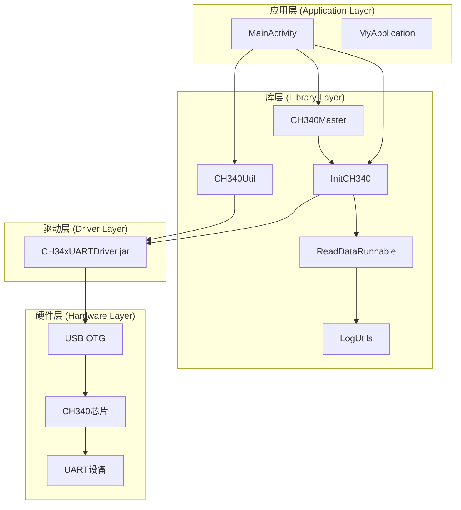
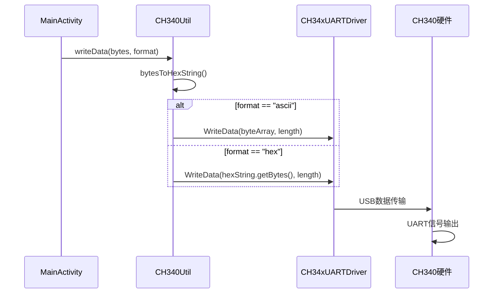
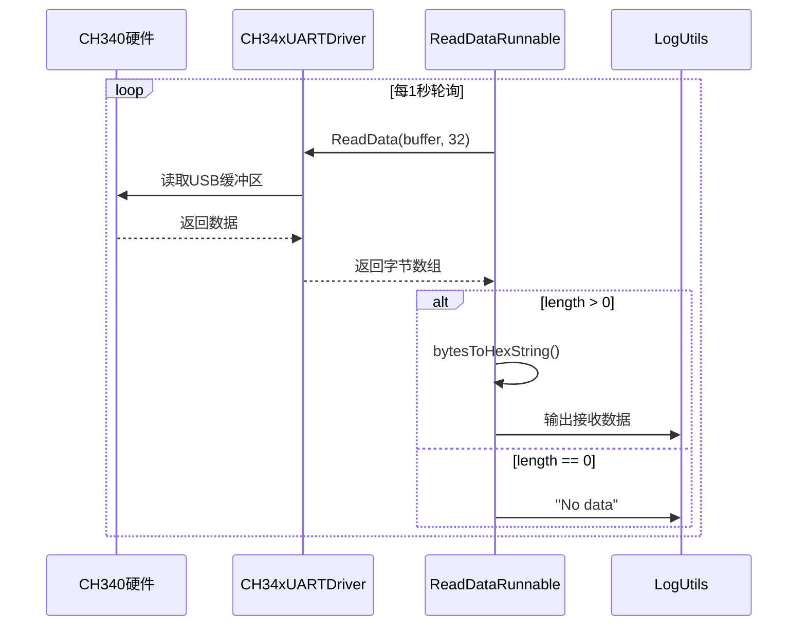
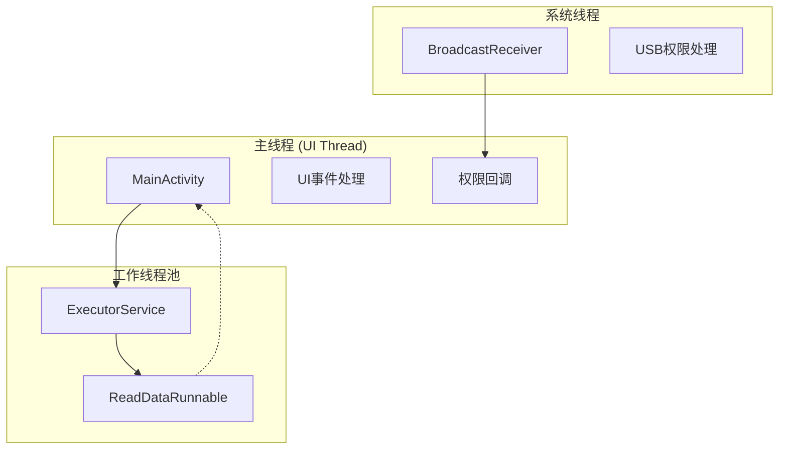
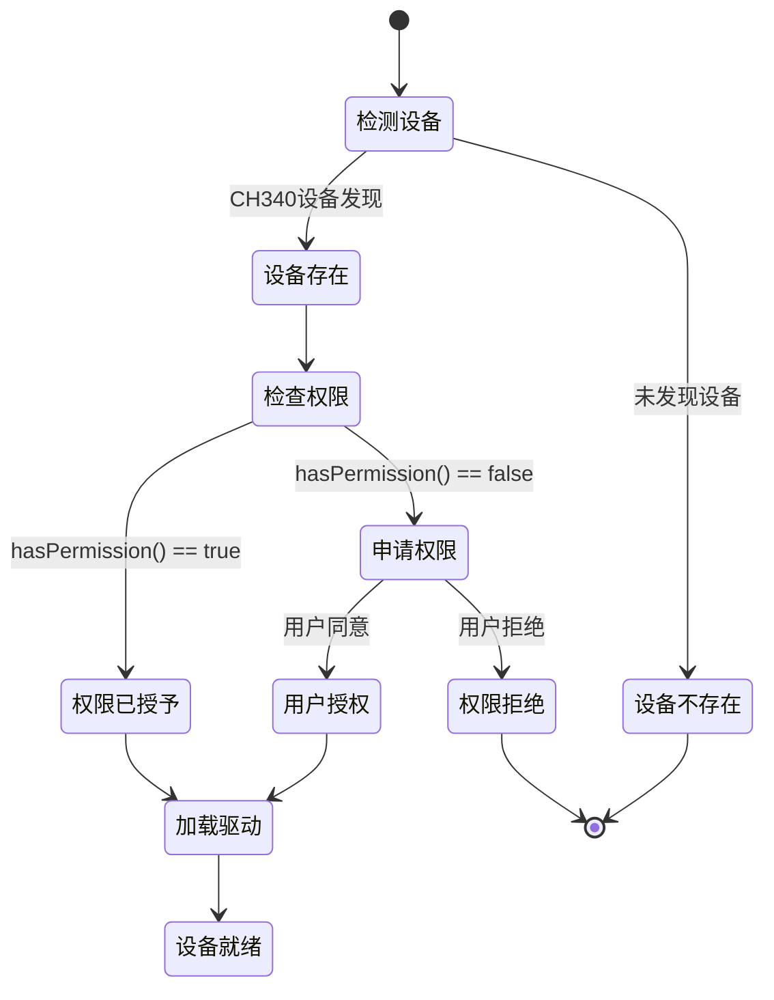

# USB-OTG-CH340-UART-interface 技术开发架构文档

## 📋 文档概述

本文档详细描述了USB-OTG-CH340-UART-interface项目的技术架构、设计模式、核心组件实现和开发规范，为开发者提供深入的技术参考。

## 🏗️ 1. 项目技术架构总览

### 1.1 整体架构设计



### 1.2 技术栈组成

| 层级 | 技术组件 | 职责描述 |
|------|----------|----------|
| **应用层** | MainActivity, MyApplication | 用户界面交互、应用生命周期管理 |
| **库层** | CH340Master, InitCH340, CH340Util | 设备初始化、数据处理、工具封装 |
| **驱动层** | CH34xUARTDriver.jar | 底层USB通信、硬件抽象 |
| **硬件层** | USB OTG, CH340, UART | 物理连接、信号转换 |

## 🔧 2. 模块分层设计详解

### 2.1 应用层 (Application Layer)

#### MainActivity.java
```java
// 核心职责：
// 1. UI交互管理
// 2. USB权限处理
// 3. 数据发送控制
// 4. 生命周期管理

public class MainActivity extends AppCompatActivity 
    implements InitCH340.IUsbPermissionListener {
    
    // 关键组件
    private Button btnSend, btnFormat;
    private EditText etContent;
    private BroadcastReceiver mUsbReceiver;
    
    // 核心流程
    onCreate() -> initData() -> initListener()
}
```

**设计模式**: 
- **观察者模式**: 实现IUsbPermissionListener接口
- **广播接收者模式**: USB权限状态监听

#### MyApplication.java
```java
// 核心职责：
// 1. 全局上下文管理
// 2. 应用初始化入口

public class MyApplication extends Application {
    private static Context mContext;
    
    // 单例模式提供全局上下文
    public static Context getContext() {
        return mContext;
    }
}
```

### 2.2 库层 (Library Layer)

#### CH340Master.java - 库初始化管理器
```java
// 核心职责：
// 1. 库的全局初始化
// 2. 上下文管理
// 3. 驱动初始化调度

public class CH340Master extends Application {
    @SuppressLint("StaticFieldLeak")
    static Context sContext;
    
    // 初始化流程
    public static void initialize(Context context) {
        sContext = context;
        initCH340Driver(); // 委托给InitCH340
    }
}
```

**设计模式**: 
- **单例模式**: 全局唯一的上下文管理
- **外观模式**: 简化库的初始化接口

#### InitCH340.java - 设备初始化核心
```java
// 核心职责：
// 1. USB设备检测和枚举
// 2. CH340驱动加载
// 3. 串口参数配置
// 4. 权限管理
// 5. 线程池管理

public class InitCH340 {
    // 关键配置参数
    private static final int baudRate = 9600;
    private static final byte dataBit = 8;
    private static final byte stopBit = 1;
    private static final byte parity = 0;
    private static final byte flowControl = 0;
    
    // 核心组件
    private static final ExecutorService mThreadPool = 
        Executors.newSingleThreadExecutor();
    private static CH34xUARTDriver driver;
    private static UsbManager mUsbManager;
    
    // 初始化流程
    initCH340() -> loadDriver() -> openCH340() -> configParameters()
}
```

**关键技术实现**:
- **设备识别**: ProductId=29987, VendorId=6790
- **权限管理**: 动态权限申请机制
- **线程管理**: 单线程池执行器
- **状态管理**: 设备开启状态跟踪

#### CH340Util.java - 数据处理工具
```java
// 核心职责：
// 1. 数据格式转换 (ASCII/HEX)
// 2. 串口数据写入
// 3. 字节数组处理

public class CH340Util {
    enum DataFormat { ASCII, HEX }
    
    // 核心方法
    public static int writeData(byte[] byteArray, String format) {
        String hexString = bytesToHexString(byteArray, byteArray.length);
        
        if ("ascii".equals(format)) {
            return InitCH340.getDriver().WriteData(byteArray, byteArray.length);
        } else if ("hex".equals(format)) {
            return InitCH340.getDriver().WriteData(hexString.getBytes(), byteArray.length);
        }
        return -1;
    }
}
```

**设计模式**: 
- **工具类模式**: 静态方法提供数据处理功能
- **策略模式**: 支持多种数据格式处理策略

#### ReadDataRunnable.java - 数据读取线程
```java
// 核心职责：
// 1. 后台数据读取
// 2. 数据格式转换
// 3. 线程生命周期管理

public class ReadDataRunnable implements Runnable {
    private boolean mStop = false;
    
    private void startReadThread() {
        while (!mStop) {
            byte[] receiveBuffer = new byte[32];
            int length = InitCH340.getDriver().ReadData(receiveBuffer, 32);
            
            // 数据处理逻辑
            if (length > 0) {
                String hexString = CH340Util.bytesToHexString(receiveBuffer, length);
                LogUtils.i(TAG, "ReadHexString===" + hexString);
            }
            
            Thread.sleep(1000); // 1秒轮询间隔
        }
    }
}
```

**技术特点**:
- **轮询机制**: 1秒间隔的数据读取
- **缓冲区管理**: 32字节接收缓冲区
- **优雅停止**: mStop标志控制线程退出

#### LogUtils.java - 日志系统
```java
// 核心职责：
// 1. 统一日志输出
// 2. 调试模式控制
// 3. 多级别日志支持

public class LogUtils {
    private static boolean mDebug = BuildConfig.DEBUG;
    
    // 支持的日志级别
    public static void e(String TAG, String message) // Error
    public static void i(String TAG, String message) // Info  
    public static void d(String TAG, String message) // Debug
    public static void v(String TAG, String message) // Verbose
    public static void w(String TAG, String message) // Warning
    public static void wtf(String TAG, String message) // What a Terrible Failure
}
```

## 🔄 3. 核心组件技术实现

### 3.1 USB设备检测与枚举

```java
// 设备检测流程
public static void initCH340(Context context) {
    mUsbManager = (UsbManager) context.getSystemService(Context.USB_SERVICE);
    HashMap<String, UsbDevice> deviceHashMap = mUsbManager.getDeviceList();
    
    for (UsbDevice device : deviceHashMap.values()) {
        // CH340设备识别
        if (device.getProductId() == 29987 && device.getVendorId() == 6790) {
            mUsbDevice = device;
            
            if (mUsbManager.hasPermission(device)) {
                loadDriver(context, mUsbManager);
            } else {
                // 触发权限申请
                listener.result(false);
            }
            break;
        }
    }
}
```

### 3.2 驱动加载与初始化

```java
// 驱动加载流程
public static void loadDriver(Context appContext, UsbManager usbManager) {
    driver = new CH34xUARTDriver(usbManager, appContext, ACTION_USB_PERMISSION);
    
    // USB Host支持检查
    if (!driver.UsbFeatureSupported()) {
        LogUtils.e(TAG, "USB HOST not supported!");
        return;
    }
    
    openCH340(); // 继续设备打开流程
}

// 设备打开与配置
private static void openCH340() {
    int ret_val = driver.ResumeUsbList();
    
    if (ret_val == 0) {
        if (driver.UartInit()) {
            isOpenDeviceCH340 = true;
            configParameters(); // 配置串口参数
        }
    }
}
```

### 3.3 串口参数配置

```java
private static void configParameters() {
    boolean isSetConfig = driver.SetConfig(
        baudRate,    // 9600
        dataBit,     // 8
        stopBit,     // 1  
        parity,      // 0 (无校验)
        flowControl  // 0 (无流控)
    );
    
    if (isSetConfig) {
        // 启动数据读取线程
        if (readDataRunnable == null) {
            readDataRunnable = new ReadDataRunnable();
        }
        mThreadPool.execute(readDataRunnable);
    }
}
```

## 📡 4. 数据流和通信机制

### 4.1 数据发送流程



### 4.2 数据接收流程



### 4.3 数据格式转换

```java
// ASCII格式: 直接发送原始字节
"Hello" -> [0x48, 0x65, 0x6C, 0x6C, 0x6F]

// HEX格式: 转换为十六进制字符串后发送
"Hello" -> "48656C6C6F" -> [0x34, 0x38, 0x36, 0x35, ...]

// 字节转十六进制实现
public static String bytesToHexString(byte[] buffer, final int size) {
    StringBuilder stringBuilder = new StringBuilder("");
    for (int i = 0; i < size; i++) {
        String hex = Integer.toHexString(buffer[i] & 0xff);
        if (hex.length() < 2) stringBuilder.append(0);
        stringBuilder.append(hex);
    }
    return stringBuilder.toString();
}
```

## 🧵 5. 线程模型和并发处理

### 5.1 线程架构设计



### 5.2 线程池管理

```java
// 单线程池设计
private static final ExecutorService mThreadPool = 
    Executors.newSingleThreadExecutor();

// 线程池使用
mThreadPool.execute(readDataRunnable);

// 线程池关闭
public static void shutdownThreadPool() {
    if (!mThreadPool.isShutdown()) {
        mThreadPool.shutdown();
    }
}
```

**设计考虑**:
- **单线程池**: 避免并发读取冲突
- **后台执行**: 不阻塞UI线程
- **优雅关闭**: 支持线程池生命周期管理

### 5.3 线程安全机制

```java
// 同步块保护USB权限处理
synchronized (this) {
    UsbDevice device = intent.getParcelableExtra(UsbManager.EXTRA_DEVICE);
    if (intent.getBooleanExtra(UsbManager.EXTRA_PERMISSION_GRANTED, false)) {
        // 权限授予处理
    }
}

// 静态变量的线程安全
private static volatile boolean isOpenDeviceCH340 = false;
```

## 🔐 6. USB设备管理和权限处理

### 6.1 权限申请流程



### 6.2 权限管理实现

```java
// 权限检查与申请
if (mUsbManager.hasPermission(device)) {
    loadDriver(appContext, mUsbManager);
} else {
    // 触发权限申请回调
    if (listener != null) {
        listener.result(false);
    }
}

// 权限申请处理
@Override
public void result(boolean isGranted) {
    if (!isGranted) {
        PendingIntent mPermissionIntent = PendingIntent.getBroadcast(
            this, 0, new Intent(ACTION_USB_PERMISSION), 0);
        InitCH340.getmUsbManager().requestPermission(
            InitCH340.getUsbDevice(), mPermissionIntent);
    }
}

// 权限结果处理
private final BroadcastReceiver mUsbReceiver = new BroadcastReceiver() {
    public void onReceive(Context context, Intent intent) {
        if (ACTION_USB_PERMISSION.equals(intent.getAction())) {
            synchronized (this) {
                UsbDevice device = intent.getParcelableExtra(UsbManager.EXTRA_DEVICE);
                if (intent.getBooleanExtra(UsbManager.EXTRA_PERMISSION_GRANTED, false)) {
                    // 权限授予，加载驱动
                    InitCH340.loadDriver(MyApplication.getContext(), 
                        InitCH340.getmUsbManager());
                }
            }
        }
    }
};
```

### 6.3 设备生命周期管理

```java
// Activity生命周期绑定
@Override
protected void onResume() {
    super.onResume();
    IntentFilter usbFilter = new IntentFilter();
    usbFilter.addAction(ACTION_USB_PERMISSION);
    registerReceiver(mUsbReceiver, usbFilter);
}

@Override
protected void onDestroy() {
    super.onDestroy();
    unregisterReceiver(mUsbReceiver);
    // 可以添加设备关闭逻辑
}
```

## ⚠️ 7. 错误处理和日志系统

### 7.1 错误处理策略

```java
// 设备打开错误处理
int ret_val = driver.ResumeUsbList();
switch (ret_val) {
    case -1:
        LogUtils.d(TAG, "Failed to open device!");
        driver.CloseDevice();
        break;
    case 0:
        if (!driver.UartInit()) {
            LogUtils.d(TAG, "Failed device initialization!");
            return;
        }
        // 成功处理
        break;
    default:
        LogUtils.d(TAG, "The phone couldn't find the device!");
        break;
}

// 数据发送错误处理
public static int writeData(byte[] byteArray, String format) {
    if ("ascii".equals(format)) {
        return InitCH340.getDriver().WriteData(byteArray, byteArray.length);
    } else if ("hex".equals(format)) {
        return InitCH340.getDriver().WriteData(hexString.getBytes(), byteArray.length);
    } else {
        return -1; // 格式错误
    }
}
```

### 7.2 日志系统设计

```java
// 日志级别定义
public class LogUtils {
    private static boolean mDebug = BuildConfig.DEBUG;
    
    // 错误日志 - 关键错误信息
    public static void e(String TAG, String message)
    
    // 信息日志 - 重要状态信息  
    public static void i(String TAG, String message)
    
    // 调试日志 - 详细调试信息
    public static void d(String TAG, String message)
    
    // 详细日志 - 最详细的信息
    public static void v(String TAG, String message)
    
    // 警告日志 - 潜在问题
    public static void w(String TAG, String message)
}

// 日志使用示例
LogUtils.i(TAG, "Serial port Settings success~");
LogUtils.e(TAG, "Your mobile phone does not support USB HOST!");
LogUtils.d(TAG, "ReadHexString===" + hexString + ",length===" + length);
```

### 7.3 异常处理机制

```java
// 线程中断处理
try {
    Thread.sleep(1000);
} catch (InterruptedException e) {
    e.printStackTrace();
    // 可以添加线程中断恢复逻辑
}

// 空指针保护
if (context == null) return;
if (mUsbManager == null) return;
if (device == null) return;

// 权限检查
if (!mUsbManager.hasPermission(device)) {
    // 触发权限申请流程
}
```

## 🔨 8. 构建配置和依赖管理

### 8.1 项目结构配置

```gradle
// 根目录 build.gradle
buildscript {
    repositories {
        google()
        jcenter()
    }
    dependencies {
        classpath 'com.android.tools.build:gradle:3.2.1'
    }
}

// app模块 build.gradle
android {
    compileSdkVersion 27
    defaultConfig {
        applicationId "com.xpf.ch340_host"
        minSdkVersion 19
        targetSdkVersion 27
        versionCode 1
        versionName "1.0"
    }
}

dependencies {
    implementation project(':ch340-library')
    implementation 'com.android.support:appcompat-v7:27.1.0'
    implementation 'com.android.support.constraint:constraint-layout:1.0.2'
}
```

### 8.2 库模块配置

```gradle
// ch340-library build.gradle
apply plugin: 'com.android.library'

android {
    compileSdkVersion 27
    defaultConfig {
        minSdkVersion 19
        targetSdkVersion 27
        versionCode 1
        versionName "1.0"
    }
}

dependencies {
    implementation files('libs/CH34xUARTDriver.jar')
    implementation 'com.android.support:appcompat-v7:27.1.0'
}
```

### 8.3 权限配置

```xml
<!-- app/src/main/AndroidManifest.xml -->
<uses-feature
    android:name="android.hardware.usb.host"
    android:required="true" />

<uses-permission android:name="android.hardware.usb.host" />

<activity android:name=".MainActivity">
    <intent-filter>
        <action android:name="android.intent.action.MAIN" />
        <category android:name="android.intent.category.LAUNCHER" />
        <action android:name="android.hardware.usb.action.USB_DEVICE_ATTACHED" />
    </intent-filter>
    
    <meta-data
        android:name="android.hardware.usb.action.USB_DEVICE_ATTACHED"
        android:resource="@xml/usb_filter" />
</activity>
```

## 📐 9. 开发规范和最佳实践

### 9.1 代码规范

```java
// 命名规范
public class CH340Master          // 类名：大驼峰
private static Context sContext   // 静态变量：s前缀
private boolean mStop            // 成员变量：m前缀
public static final String TAG   // 常量：全大写

// 方法命名
public static void initialize()  // 动词开头
public static boolean isOpenDevice() // 布尔值is开头
public static Context getContext()    // 获取方法get开头

// 注释规范
/**
 * 方法功能描述
 * @param context 参数描述
 * @return 返回值描述
 */
public static void initialize(Context context) {
    // 实现逻辑
}
```

### 9.2 设计模式应用

```java
// 1. 单例模式 - 全局上下文管理
public class CH340Master {
    private static Context sContext;
    
    public static Context getAppContext() {
        if (sContext == null) {
            throw new NullPointerException(APPLICATION_CONTEXT_IS_NULL);
        }
        return sContext;
    }
}

// 2. 观察者模式 - USB权限监听
public interface IUsbPermissionListener {
    void result(boolean isGranted);
}

// 3. 工厂模式 - 线程池创建
private static final ExecutorService mThreadPool = 
    Executors.newSingleThreadExecutor();

// 4. 策略模式 - 数据格式处理
enum DataFormat { ASCII, HEX }
```

### 9.3 性能优化建议

```java
// 1. 避免内存泄漏
@SuppressLint("StaticFieldLeak")
static Context sContext; // 使用Application Context

// 2. 线程池复用
private static final ExecutorService mThreadPool = 
    Executors.newSingleThreadExecutor();

// 3. 字符串构建优化
StringBuilder stringBuilder = new StringBuilder("");
for (int i = 0; i < size; i++) {
    // 使用StringBuilder而非String拼接
}

// 4. 及时释放资源
@Override
protected void onDestroy() {
    super.onDestroy();
    unregisterReceiver(mUsbReceiver);
    InitCH340.shutdownThreadPool();
}
```

### 9.4 调试技巧

```java
// 1. 分级日志输出
LogUtils.d(TAG, "Debug info: " + debugInfo);
LogUtils.i(TAG, "Important status: " + status);
LogUtils.e(TAG, "Error occurred: " + error);

// 2. 状态跟踪
LogUtils.i(TAG, "ProductId:" + device.getProductId() + 
           ",VendorId:" + device.getVendorId());

// 3. 数据流跟踪
String hexString = CH340Util.bytesToHexString(byteArray, byteArray.length);
LogUtils.i(TAG, "WriteHexString===" + hexString);

// 4. 条件编译
if (BuildConfig.DEBUG) {
    // 调试代码
}
```

## 🔧 10. 扩展和维护指南

### 10.1 功能扩展点

```java
// 1. 支持更多串口参数
public static void configCustomParameters(
    int baudRate, byte dataBit, byte stopBit, 
    byte parity, byte flowControl) {
    
    boolean isSetConfig = driver.SetConfig(
        baudRate, dataBit, stopBit, parity, flowControl);
    // 配置逻辑
}

// 2. 添加数据回调接口
public interface DataReceiveListener {
    void onDataReceived(byte[] data, int length);
    void onError(String error);
}

// 3. 支持多设备管理
public class MultiDeviceManager {
    private Map<String, CH34xUARTDriver> drivers;
    
    public void addDevice(String deviceId, UsbDevice device) {
        // 多设备管理逻辑
    }
}
```

### 10.2 性能监控

```java
// 1. 数据传输统计
public class TransferStatistics {
    private long totalBytesSent = 0;
    private long totalBytesReceived = 0;
    private long transferStartTime = 0;
    
    public void recordSentData(int bytes) {
        totalBytesSent += bytes;
    }
    
    public double getTransferRate() {
        long duration = System.currentTimeMillis() - transferStartTime;
        return (totalBytesSent + totalBytesReceived) / (duration / 1000.0);
    }
}

// 2. 连接状态监控
public class ConnectionMonitor {
    private boolean isConnected = false;
    private long lastHeartbeat = 0;
    
    public void checkConnection() {
        // 连接状态检查逻辑
    }
}
```

### 10.3 错误恢复机制

```java
// 1. 自动重连机制
public class AutoReconnect {
    private static final int MAX_RETRY_COUNT = 3;
    private int retryCount = 0;
    
    public void attemptReconnect() {
        if (retryCount < MAX_RETRY_COUNT) {
            retryCount++;
            // 重连逻辑
            initCH340(context);
        }
    }
}

// 2. 设备状态恢复
public static void resetDevice() {
    if (driver != null) {
        driver.CloseDevice();
    }
    isOpenDeviceCH340 = false;
    // 重新初始化
    initCH340(sContext);
}
```

### 10.4 版本兼容性

```java
// 1. API级别兼容
if (Build.VERSION.SDK_INT >= Build.VERSION_CODES.M) {
    // Android 6.0+ 权限处理
} else {
    // 旧版本处理
}

// 2. 设备兼容性检查
public static boolean isDeviceSupported() {
    return Build.VERSION.SDK_INT >= Build.VERSION_CODES.KITKAT &&
           context.getPackageManager().hasSystemFeature(
               PackageManager.FEATURE_USB_HOST);
}
```

## 📊 11. 技术指标和性能基准

### 11.1 性能指标

| 指标项 | 数值 | 说明 |
|--------|------|------|
| **串口波特率** | 9600 bps | 默认通信速率 |
| **数据位** | 8 bit | 数据位长度 |
| **停止位** | 1 bit | 停止位长度 |
| **校验位** | None | 无校验 |
| **读取间隔** | 1000 ms | 数据轮询间隔 |
| **缓冲区大小** | 32 bytes | 接收缓冲区 |
| **最小API级别** | 19 (Android 4.4) | 系统兼容性 |
| **目标API级别** | 27 (Android 8.1) | 目标系统版本 |

### 11.2 资源占用

```java
// 内存占用分析
- 静态变量: Context, UsbManager, CH34xUARTDriver
- 线程池: 单线程ExecutorService
- 缓冲区: 32字节接收缓冲区
- 日志缓存: 根据BuildConfig.DEBUG动态控制

// CPU占用分析
- 主线程: UI交互和权限处理
- 工作线程: 1秒间隔的数据读取轮询
- 系统线程: USB权限广播接收
```

## 🎯 12. 总结

本项目采用分层架构设计，通过应用层、库层、驱动层的清晰分离，实现了USB OTG与CH340 UART设备的可靠通信。核心技术特点包括：

1. **模块化设计**: 清晰的职责分离和接口定义
2. **线程安全**: 单线程池和同步机制保证数据一致性
3. **权限管理**: 完整的USB设备权限申请和处理流程
4. **错误处理**: 多层次的错误检测和恢复机制
5. **性能优化**: 合理的轮询间隔和资源管理
6. **扩展性**: 良好的架构设计支持功能扩展

该架构为Android平台的USB串口通信提供了一个稳定、可靠的解决方案，适用于各种需要与外部UART设备通信的应用场景。